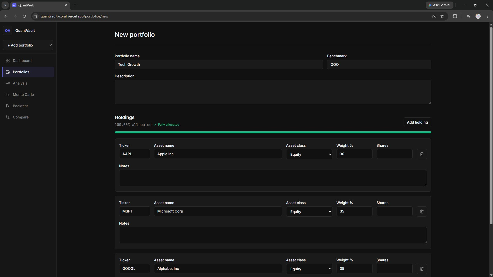
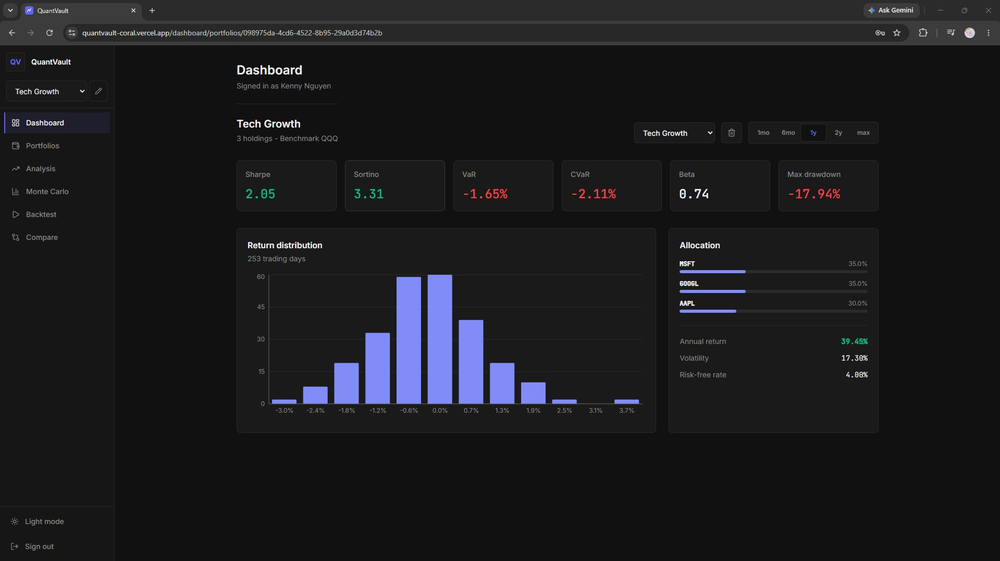
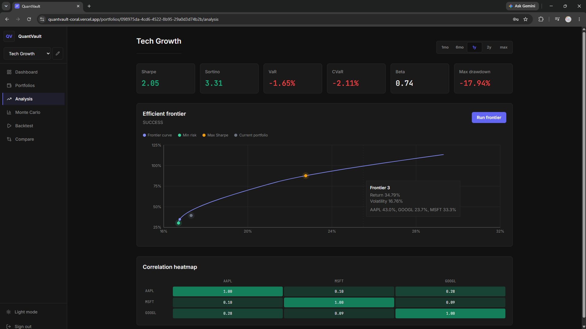
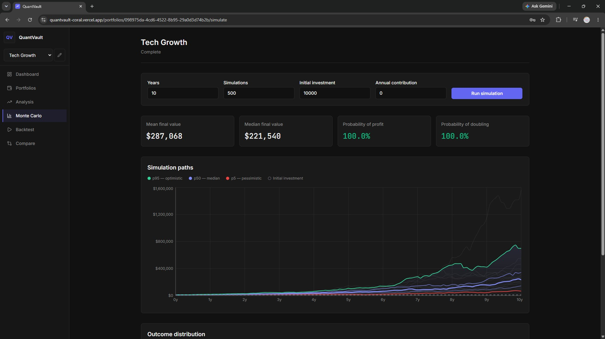
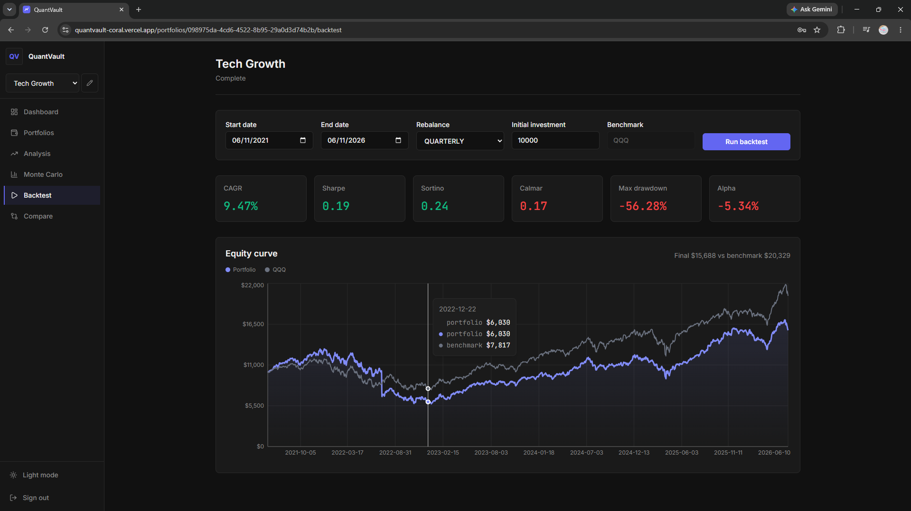
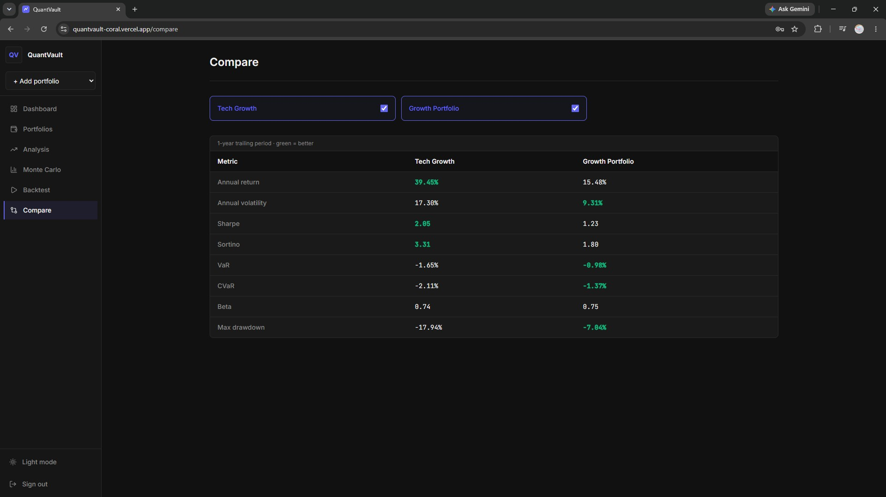

# QuantVault

[](https://github.com/cs-keni/quantvault/actions/workflows/ci.yml)


QuantVault is a portfolio analytics and risk modeling platform for evaluating
multi-asset portfolios with real market data. It combines a production-style
FastAPI/React architecture with finance-specific engines for Markowitz
efficient frontier optimization, historical VaR/CVaR, fat-tailed Monte Carlo
simulation, and historical backtesting.

The motivation is practical: a brokerage account can show balances and holdings,
but it usually does not explain allocation risk, downside exposure, correlation,
or how a portfolio might behave under different return paths. QuantVault turns
holdings into measurable risk and return profiles, then exposes the assumptions
in code so the results can be inspected, tested, and explained.

> Status: complete. Backend, frontend, migration, and Docker checks passing.
> Demo video recorded. Live screenshots below.

## Demo

- Live app: _add deployment URL_
- Demo video: _add video URL_
- Demo portfolio used in screenshots: **VTI 60% / BND 30% / VXUS 10%**

Recommended demo flow:

1. Register or log in.
2. Create the VTI/BND/VXUS portfolio.
3. Review dashboard metrics: return, volatility, Sharpe, VaR, CVaR, beta, and
   drawdown.
4. Run efficient frontier analysis to compare the current allocation against
   min-volatility and max-Sharpe portfolios.
5. Run Monte Carlo simulation to show percentile outcomes and downside paths.
6. Run a historical backtest against the selected benchmark.
7. Compare portfolios side by side.

## Why This Project Matters

QuantVault is meant to show more than CRUD app fluency. For a student or new
graduate, it demonstrates the ability to connect software engineering with a
domain where correctness, assumptions, and communication matter.

What it proves technically:

- Building a full-stack app with authentication, async database access,
  migrations, caching, background-task patterns, charts, tests, Docker, and CI.
- Separating financial calculations into service modules with focused tests
  instead of hiding math inside route handlers.
- Handling realistic deployment constraints, including managed Postgres,
  managed Redis, cloud-host market-data limitations, CORS, and frontend/backend
  environment separation.

What it teaches practically:

- A student with real index-fund holdings can use it to understand allocation
  concentration, risk-adjusted returns, drawdowns, and tail-risk estimates.
- It does **not** replace professional financial advice or a brokerage platform,
  but it is useful for learning why "my portfolio is up" is a much weaker
  statement than "I understand my portfolio's volatility, downside risk,
  benchmark behavior, and allocation tradeoffs."
- It creates interview material that can be explained from both sides: the
  engineering system and the financial model.

## Architecture

```
                 browser
                   |
                   v
        React + TypeScript + Vite
                   |
          nginx /api/ proxy
                   |
                   v
              FastAPI API
              /api/v1/*
          /       |        \
         v        v         v
 PostgreSQL 16  Redis 7   analytics tasks
 portfolios,   market     Celery worker locally,
 users, task   data +     eager execution on Render
 results       task cache
```

The frontend uses React, TanStack Query, Zustand, Tailwind CSS, and Recharts.
The backend uses FastAPI, SQLAlchemy 2.0 async sessions, Alembic migrations,
PyJWT authentication, Redis caching, and Celery task definitions for CPU-bound
analytics tasks. Local Docker Compose runs a Celery worker. The single-service
Render deployment sets `USE_CELERY=false`, runs those tasks synchronously in the
request process, and returns completed task results directly.

Market data is fetched from Tiingo when `TIINGO_API_KEY` is configured, which is
the production path for cloud hosts where Yahoo Finance blocks shared IP ranges.
Local development can leave `TIINGO_API_KEY` empty and use yfinance/Yahoo Finance
instead. Raw market prices are not persisted in Postgres.

## Technical Highlights

- **Real market data path**: Tiingo in cloud deployments, yfinance/Yahoo for
  local development, with Redis TTL caching for historical prices, quotes, and
  metadata.
- **Async FastAPI backend**: SQLAlchemy 2.0 async sessions, Alembic migrations,
  JWT auth, and route-level ownership checks.
- **Task architecture**: Celery task definitions for efficient frontier, Monte
  Carlo, and backtests. Local Docker Compose runs a worker; Render demo deploys
  as a single service with eager execution.
- **Financial math services**: portfolio metrics, risk analytics, optimization,
  simulation, and backtesting live in dedicated service files with targeted
  tests.
- **Production-oriented frontend**: protected routes, auth refresh flow,
  TanStack Query data fetching, responsive app shell, chart components, and
  typed API boundaries.
- **Verification**: backend unit/API tests, frontend tests, lint/type checks,
  Alembic drift checks, Docker Compose build, and GitHub Actions CI.

## Financial Concepts

### Modern Portfolio Theory

QuantVault computes portfolio-level expected return, volatility, Sharpe ratio,
and covariance from historical daily returns. The efficient frontier uses
Markowitz optimization to find allocations with the lowest volatility for a
given target return and to identify the max-Sharpe portfolio under long-only
weight constraints.

### Historical VaR and CVaR

Value at Risk is calculated with historical simulation. QuantVault uses the
empirical distribution of weighted portfolio returns rather than assuming a
normal distribution. Annual VaR is based on a rolling 252-trading-day window,
not `daily_var * sqrt(252)`. CVaR averages the tail losses beyond VaR and
guards against empty tail slices on small samples.

### Student-t Monte Carlo

The Monte Carlo engine is not geometric Brownian motion. It draws from a
Student-t distribution with 5 degrees of freedom and scales those fat-tailed
shocks by observed daily volatility. This makes the simulation more explicit
about tail risk than a normal-return GBM shortcut. Contributions are injected
at year boundaries and compound forward.

## Features

- Portfolio builder with target weights and asset-class validation.
- Risk dashboard with Sharpe, Sortino, VaR, CVaR, beta, max drawdown, and
  return distribution.
- Efficient frontier analysis with cache-aware Celery polling.
- Monte Carlo simulation with persisted task status and percentile paths.
- Backtesting with CAGR, drawdown, alpha, benchmark comparison, and equity
  curve output.
- Portfolio comparison across side-by-side risk metrics.

## Example Questions QuantVault Answers

- Is this allocation mostly equity risk, bond risk, or diversified risk?
- How did this portfolio behave historically against a benchmark?
- What drawdown would I have experienced in the backtest window?
- How much return did the portfolio earn per unit of volatility?
- How do VaR and CVaR describe the left tail of recent historical returns?
- What allocations sit on the efficient frontier for these assets?
- Under fat-tailed simulated returns, what range of outcomes should I expect?

## Local Development

Copy the example environment and start the stack:

```bash
cp .env.example .env
docker compose up --build
```

The frontend is available at `http://localhost:3000`; the backend health check
is `http://localhost:8000/health`.

For backend-only development:

```bash
cd backend
python -m venv .venv
. .venv/bin/activate
pip install -r requirements-dev.txt
alembic upgrade head
uvicorn app.main:app --reload
```

For frontend-only development:

```bash
cd frontend
npm ci
npm run dev
```

## Checks

Backend:

```bash
cd backend
.venv/bin/ruff check app
.venv/bin/mypy app
.venv/bin/pytest -q
```

Frontend:

```bash
cd frontend
npm run lint
npm test
npm run build
```

Docker:

```bash
docker compose build
```

## Deployment

The intended demo deployment is:

- **Supabase** for Postgres. Set Render `DATABASE_URL` to the async SQLAlchemy
  URL, for example `postgresql+asyncpg://...`.
- **Upstash** for Redis. Set Render `REDIS_URL` to the Upstash `rediss://...`
  URL.
- **Render** for the backend Docker web service using `render.yaml`.
- **Vercel** for the frontend in `frontend/`, with `VITE_API_BASE_URL` set to
  the Render backend origin, for example `https://quantvault-api.onrender.com`.

Required production env vars:

- Render: `DATABASE_URL`, `REDIS_URL`, `SECRET_KEY`, `CORS_ORIGINS`,
  `USE_CELERY=false`, `PORT=8000`, `TIINGO_API_KEY`.
- Vercel: `VITE_API_BASE_URL`.

Set `CORS_ORIGINS` to the deployed Vercel origin exactly, comma-separated if
there is more than one allowed origin. `frontend/vercel.json` rewrites all
frontend routes to `index.html` so direct React Router URLs work.

## Screenshots

Demo portfolios: **Tech Growth** (AAPL 30% / MSFT 35% / GOOGL 25% / BND 10%) and a diversified **VTI / BND / VXUS** portfolio.













## Disclaimer

QuantVault is an educational software project and portfolio showcase. It is not
financial advice, does not execute trades, and should not be used as the sole
basis for investment decisions.
